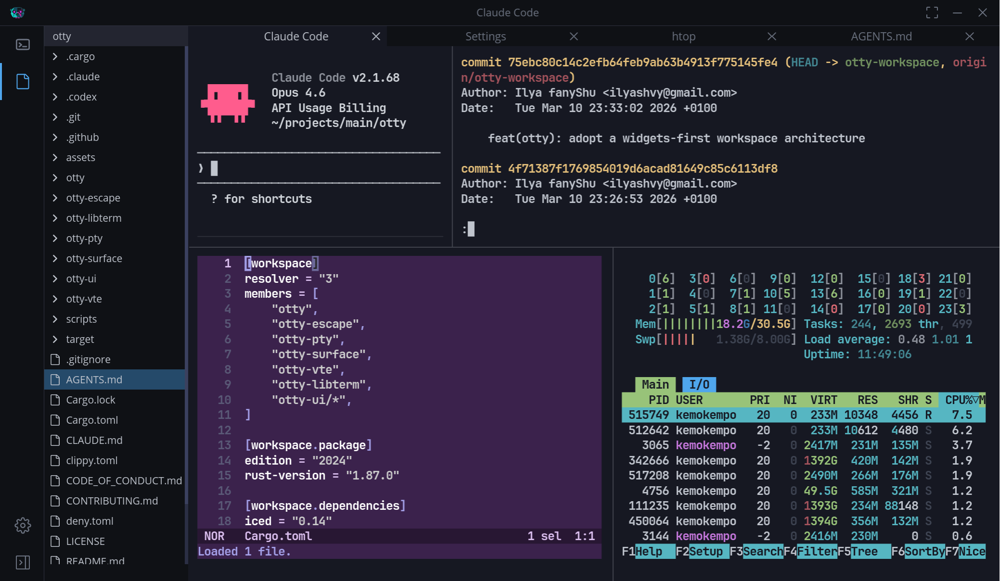

    
    <h4>OTTY - an open-source, terminal-centric workspace that transforms your shell into a true IDE.</h4>

> **WORK IN PROGRESS**: Now this project is under active development phase, you can support it by providing your thoughts, development ideas and even contributing as a developer.

### About

    

OTTY is not just one more blazing fast terminal emulator, OTTY rethinks the terminal itself as the only workspace you need for development or operation your system.

Developers spend most of their time in the terminal, but modern terminals remain minimal shells. As a result, engineers juggle between the terminal, code editors (AI and not), different dashboards, and SSH clients instead of working in one coherent space.

#### Install

Prebuilt artifacts are published on the GitHub Releases page: https://github.com/otty-shell/otty/releases

#### Supported Platforms

- Linux: DEB- and RPM-based distributions (`.deb` / `.rpm`).
- macOS: Intel (`x86_64`) and Apple Silicon (`aarch64`) builds (`.dmg`).

#### What works today

- Desktop app:
  - Tabs and split screen.
  - Block-oriented terminal UX.
    - Block highlight
    - Semantic copy (prompt, content, command)
- Terminal stack powering the app:
  - `otty-ui-term`: the terminal widget for Iced.
  - `otty-libterm`: request/event-driven terminal engine.
  - `otty-surface`: in-memory surface model (grid, selection/search, snapshots, blocks).
  - `otty-escape` + `otty-vte`: VT parser + semantic actions (see `otty-escape/docs/support_sequences.md`).
  - `otty-pty`: PTY backends.

#### What is planned (not implemented yet)

- App settings and customizations (fonts, colors, profiles, shell, etc...).
- SSH connections catalog.
- Support windows platform.
- Automatically app version upgrade.
- Tool management (install/remove SDKs and CLIs).
- Plugins system.
- AI agent integrations.
- Secret storage.
- File tree widget.

More details about the future plans will be appeared soon in roadmap.

### License

See [LICENSE](./LICENSE).

### CONTRIBUTORS

See [CONTRIBUTING.md](./CONTRIBUTING.md).
