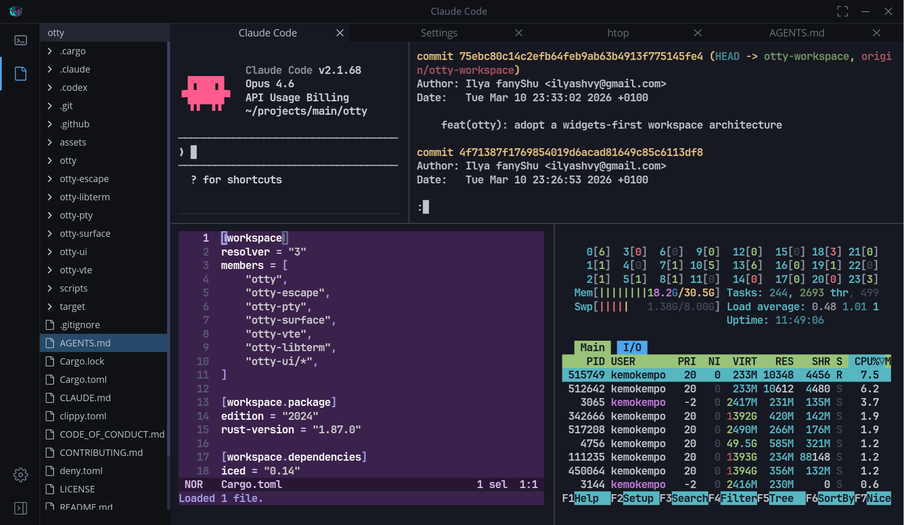

    <picture align=center>
        <source media="(prefers-color-scheme: dark)" srcset="./assets/logo/logo-full.png">
        <source media="(prefers-color-scheme: light)" srcset="./assets/logo/logo-full.png">
        
    </picture>
    <h4>OTTY - an open-source terminal-centric workspace for development and operations.</h4>

> **WORK IN PROGRESS**: Now this project is under active development phase, you can support it by providing your thoughts, development ideas and even contributing as a developer.

### About

    

OTTY is not just another blazing-fast terminal emulator. It starts from a different premise: the terminal should be the primary workspace for development and operations, not just a shell inside a fragmented toolchain.

Developers already spend much of their time in the terminal, yet modern terminals remain narrow interfaces. As a result, engineers constantly switch between the terminal, editors, dashboards, and SSH clients instead of working in one coherent environment. OTTY is built to turn the terminal into that environment.

### Key feautres

- **Explorer that stays in sync with your work**  
  Browse project files from the sidebar and keep navigation aligned with the directory of the active terminal session.

- **Quick Launch for saved commands and SSH targets**  
  Save frequently used commands or SSH connections and launch them without retyping the same input every time.

- **Block-based terminal UI**  
  OTTY structures terminal output activity around atomic command blocks, making it easier to control each command and its output.

### Install

#### From artifacts

Prebuilt artifacts are published on the GitHub Releases page: https://github.com/otty-shell/otty/releases

The single `amd64` DEB artifact supports Ubuntu 20.04, 22.04, and 24.04. The
OpenSSL used by OTTY's SSH backend is statically included for portability, so
upgrading OTTY also upgrades its bundled OpenSSL. Compatibility with other
Linux distributions is not implied by this Ubuntu test matrix.

### Supported Platforms

- Linux DEB: Ubuntu 20.04, 22.04, and 24.04 on `amd64`.
- Linux RPM: RPM package artifact (`x86_64`).
- macOS: Intel (`x86_64`) and Apple Silicon (`aarch64`) builds (`.dmg`).

### Roadmap

See [OTTY Project](https://github.com/orgs/otty-shell/projects/1)

### License

See [LICENSE](./LICENSE)

### CONTRIBUTORS

See [CONTRIBUTING.md](./CONTRIBUTING.md)
